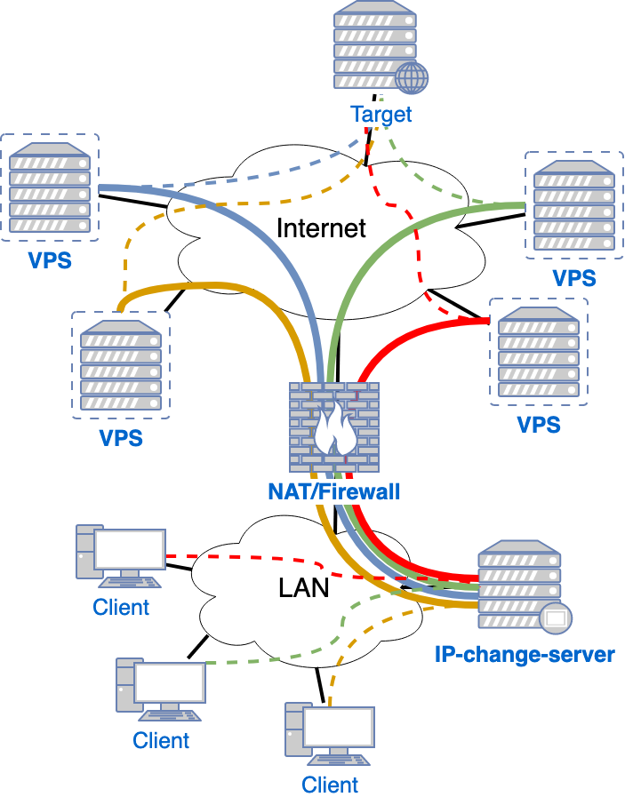

# dvpn
Dynamic VPN change

---
title: Group-IB
tags: Templates, Talk
description: View the slide with "Slide Mode".
---

# IP changing

## Problem

In order to perform penetration testing, there is a need to conduct aggressive scanning of the target. However, these kinds of actions most likely to be banned by a firewall or IPS. In this case, the whole internal network of the security analysts will have no access to the target. 

## Solution

To avoid banning of external gateway IP address VPS servers should be used. The egress network traffic can be managed in such a way that it will be routed through different VPSs and source IP addresses will not be the same.

## Requirements

sudoers: user nopassword all - ansible playbook requires sudo
generate ssh keys and add public key to routes.py

### Solution architecture

#### Ansible Playbooks

For a multiplicity of tester's public IP addresses system will use Virtual Private Servers rented from any VPS provider. Usually, an initial configuration of it has SSH connection with root user authorized by a password. For automatic configuration of virtual hosts *Ansible* tool should be used. 

Ansible has human-readable *playbooks* files which contain configuration commands for a group of hosts. It easy to read, write, test, and change for any specific case.

* Add ansible user.
    It is not safe to work with **root** privileges and that's reasonable to add *ansible* user for each virtual host as an initial configuration. Provide for this user necessary privileges (sudo group). Also the SSH deamon for the new user should be configured along with his ssh key-pairs.

* Change default SSH configuration.
    It is better to change default SSH server configuration: at least block root authentication with password.

* VPN - there are several optons of VPN setup (encrypted/unencrypted tunnel establishing):
    * OpenVPN - open-source implementation of virtual private network with usage of TLS/SSL protocol for key exchanging. 
    * SSH - has embedded tools for tunnel establishing and can be used as VPN.
    * IProute2 - Can use General Routing Encapsulation to make simple unencrypted tunnel.

* Key generation.
    For automatic authentication it is reasonable to use Public Key Infrastructure with *easy-rsa* tool.
    * Authentication Center - it is necessary to initially deploy AC, generate the master Certificate Authority (CA) certificate & key.
    * key issuing - this script will be used for generation and signing keys for each new VPS in the system. 

* Configuration check (current VPS configuration).
    
* Gateway.
     Scripts that will be applied to the Router. It will establish NAT and routing depending on the tester and the target.
    * routing - personal NAT rules
    * firewall?
    
* Monitoring
    This part can be implemented separately from ansible.
    * Zabbix??? we not sure how can we use it with ansible.
        * VPS -dead/alive?
        * Traffic log
    * Custom scripts using SNMP.
        * VPN connection status
        * network statistics
        * network bandwidth utilization
        * etc 

#### Backend

Backend side of the application will be written on Python language along with the Flask framework to run the server. 

* interaction with ansible - collect the information from VPS servers and form it as a reply for client requests. For this task will be used *subprocess* python module, it can launch another system programs.
* rent of VPS - for providers who have API is possible to make VPS rent automatically.
* authentication? It looks reasonable for each tester to have individual VPN parameters. 

#### Frontend

Web-application will be based on the Angular framework. It should contain the following functionality:

* List of available VPS servers (IP, country, provider)
* VPS server in use
* Traffic load monitoring
* Checking of blacklisted VPS
* Remove VPS (clean up)
* Rent VPS - optional
* Status of VPS configuration
* key management

# TODO and questions

* how to organize package installations for different distributives?
* how to use tasks?
